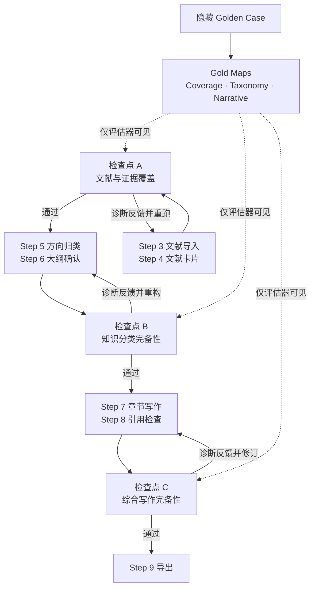

# Golden Case 红队验证基准与 AutoResearch 交互设计

## 1. 定位

《数据驱动的电力系统暂态稳定评估方法综述》作为隐藏的 Golden Case，只供红队评估器读取，不直接提供给 AutoResearch 生产端。它用于验证系统能否独立重建一套覆盖充分、结构合理、证据完整、叙事连贯的综述，而不是要求生成文本复写原文。

Golden Case 被抽象为三类基准：

1. **Gold Coverage Map**：研究问题、技术路线、子方法、比较维度、代表性证据、局限与未来方向。
2. **Gold Taxonomy Map**：主题之间的层级、边界、交叉关系和合理叙事顺序。
3. **Gold Narrative Map**：从研究背景到分类综述、横向比较、局限归纳和研究展望的论证链，以及关键论断与证据之间的关系。

> 为防止答案泄漏，每个检查点必须先冻结 AutoResearch 的首次输出并计算基线得分，再向生产端返回诊断。修复后的结果另行计分，不覆盖首次得分。

## 2. 总体交互图



三个检查点均遵循同一协议：

```text
冻结首次输出 → 隐藏式比较 → 记录首次得分
             → 返回诊断标签 → 可选修复 → 记录修复后得分
```

## 3. A、B、C 与生产流程的交互

| 检查点 | 对应环节 | 冻结的 AutoResearch 产物 | Golden Benchmark 输入 | 红队重点检查 | 返回生产端的诊断 | 回流位置 |
|---|---|---|---|---|---|---|
| A. 文献与证据覆盖 | Step 3 文献导入 + Step 4 文献卡片 | SourceTable、检索日志、去重结果、SourceCard、证据片段 | Gold Coverage Map 中的核心主题、加权代表文献和关键证据单元 | 核心文献召回、主题证据覆盖、卡片抽取准确性、元数据完整性 | 缺失主题 ID、证据稀薄方向、错误/重复卡片、需要扩检的关键词方向；不直接泄露 Golden 原文 | Step 3 扩检，或 Step 4 重新抽取 |
| B. 知识分类完备性 | Step 5 方向归类 + Step 6 大纲确认 | TopicCluster、文献—主题映射、章节树、各节证据预算 | Gold Coverage Map + Gold Taxonomy Map | 重要方向遗漏、分类重叠、孤立文献、章节失衡、前后依赖和论证顺序 | 缺失类别、重叠类别对、无归属证据、证据不足章节、顺序冲突；允许不同于 Golden Case 的合理分类 | Step 5 重新聚类，或 Step 6 调整大纲 |
| C. 综合写作完备性 | Step 7 章节写作 + Step 8 引用检查 | 章节草稿、Claim–Citation Map、引用位置、SourceChunk、跨文献比较句 | Gold Narrative Map + 关键 Claim–Evidence 关系 | 是否从罗列走向综合、关键比较是否完整、结论是否有证据、引用是否支持对应论断、局限与展望能否由前文推出 | 缺失叙事功能、Unsupported Claim ID、引用错配、仅罗列未综合的段落、尚未闭合的 Research Gap | Step 7 重写综合段落，或 Step 8 修复证据绑定 |

## 4. 三个检查点的具体交互逻辑

### A. 文献与证据覆盖

1. Step 3–4 完成后，系统冻结 SourceTable、SourceCard 和检索轨迹。
2. 红队将生产端的文献与概念映射到 Gold Coverage Map，而不是只比较标题字符串。
3. 首次评估记录：
   - 加权核心文献召回率；
   - 关键知识单元覆盖率；
   - SourceCard 抽取准确率；
   - 元数据与证据片段完整率。
4. 红队只返回“缺失在哪个知识方向、为什么证据不足”，不直接把 Golden 文献清单和原文段落交给 Agent。
5. Agent 可触发扩检或重新制卡；修复增益单独记录。

A 检验的是：**系统有没有找到足够支撑一篇完整综述的证据基础。**

### B. 知识分类完备性

1. Step 5–6 完成后，冻结 TopicCluster、文献—主题映射和章节树。
2. 红队执行概念级对齐：允许标题和分类标准不同，但要求核心知识空间能够被覆盖。
3. 重点识别：
   - Golden Case 中的重要方向是否无对应节点；
   - 同一批文献是否被多个章节重复使用但没有不同分析目的；
   - 是否出现大量无归属文献；
   - 是否存在“章节很大但证据很少”或“重要方向只有一个小节”的失衡；
   - 前置概念、方法比较和研究展望的顺序是否合理。
4. 反馈首先回到 Step 5 调整分类；分类成立后，再由 Step 6 重构章节层次。

B 检验的是：**系统能否把文献集合组织成覆盖充分、边界清楚、逻辑闭合的知识地图。**

### C. 综合写作完备性

1. Step 7–8 完成后，冻结章节文本、Claim–Citation Map 和引用证据片段。
2. 红队不计算与 Golden Case 的文本相似度，而是比较叙事功能是否齐全。
3. 重点识别：
   - 章节是否只是逐篇罗列；
   - 是否说明方法之间的共同点、差异、适用条件和代价；
   - 重要判断是否能追溯到具体证据；
   - 引用是否真的支持所在句子的论断；
   - 局限、Research Gap 与未来方向是否由前文分析自然推出。
4. 写作问题回到 Step 7；证据错配和引用缺失回到 Step 8。

C 检验的是：**系统能否把“完整的材料”转化为“完整且可信的综述论证”。**

## 5. 同领域与跨领域的使用边界

| 使用场景 | 可以使用的 Golden Benchmark | 不应强制比较的内容 |
|---|---|---|
| 同领域回放测试 | Coverage、Taxonomy、Narrative 三类 Map；可比较核心文献和知识单元 | 不要求章节标题、分类方法和文字表达完全一致 |
| 跨领域 AutoResearch | 分类完整性、叙事功能、证据绑定和写作质量等抽象规则 | 不比较具体技术方向、具体文献和原文结论 |

因此，这篇 Golden Case 在同领域是“内容级标准答案”，在不同领域则只作为“结构、论证和写作质量参考”。红队最终输出应至少区分：

- **Missing**：重要内容或证据没有覆盖；
- **Misorganized**：内容存在，但分类、层级或顺序不合理；
- **Unsupported**：已经形成论断，但证据或引用不足。
