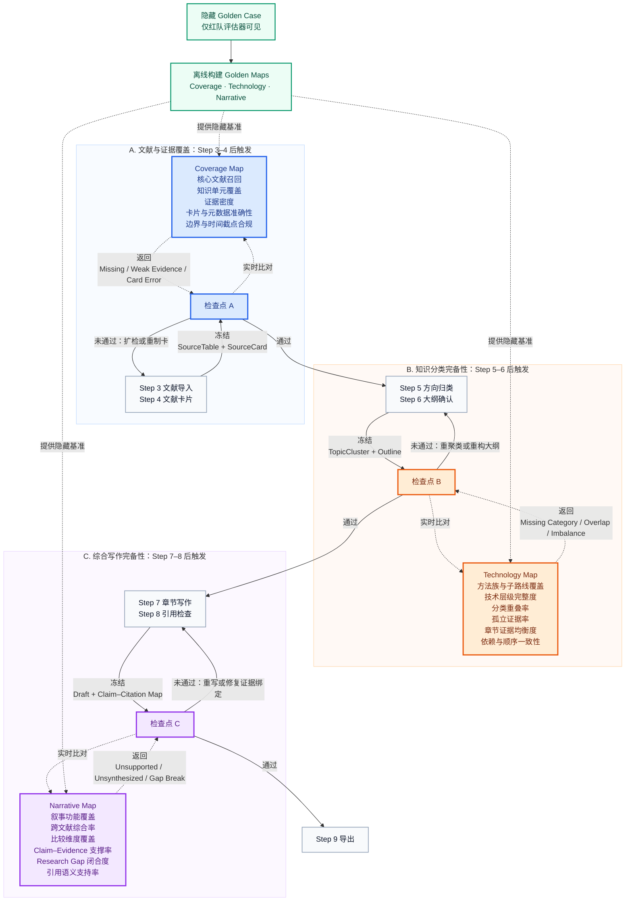

# Golden Case 红队验证基准与 AutoResearch 交互设计

## 1. 定位

《数据驱动的电力系统暂态稳定评估方法综述》作为隐藏的 Golden Case，只供红队评估器读取，不直接提供给 AutoResearch 生产端。它用于验证系统能否独立重建一套覆盖充分、结构合理、证据完整、叙事连贯的综述，而不是要求生成文本复写原文。

Golden Case 被抽象为三类基准：

1. **Gold Coverage Map**：核心文献、关键知识单元、证据片段、检索边界与时间截点。
2. **Gold Technology Map（技术分类与谱系）**：技术路线、方法族、子方法、前置依赖、适用条件及其层级与交叉关系。
3. **Gold Narrative Map**：从研究背景到分类综述、横向比较、局限归纳和研究展望的论证链，以及关键论断与证据之间的关系。

> 为防止答案泄漏，每个检查点必须先冻结 AutoResearch 的首次输出并计算基线得分，再向生产端返回诊断。修复后的结果另行计分，不覆盖首次得分。

## 2. 总体交互图



### 三类 Golden Map 的指标口径

| Golden Map | 被比较的对象 | 核心指标 | 对应检查点 |
|---|---|---|---|
| Coverage Map | SourceTable、SourceCard、证据片段与检索边界 | 加权核心文献召回率、关键知识单元覆盖率、主题证据密度、卡片与元数据准确率、范围及时间截点合规率 | A |
| Technology Map | TopicCluster、文献—主题映射、技术章节树与 Outline | 方法族和子路线覆盖率、技术层级完整度、分类重叠率、孤立证据率、章节证据均衡度、依赖与顺序一致性 | B |
| Narrative Map | Draft、Claim–Citation Map、SourceChunk 与跨文献比较句 | 叙事功能覆盖率、跨文献综合率、比较维度覆盖率、Claim–Evidence 支撑率、Research Gap 推导闭合度、引用语义支持率 | C |

Coverage Map 是底层证据基座；Technology Map 判断这些证据是否被组织成完整的技术谱系；Narrative Map 判断技术谱系是否进一步转化为可信、连贯的综述论证。三者依次回答“材料够不够”“结构全不全”“文章是否真正讲清楚”。

### 检查点交互协议

图中的“实时比对”是**阶段完成后的事件触发式交互**，不是在 Agent 写作过程中持续窥视或逐 token 干预。每个检查点执行同一套协议：

1. **冻结快照**：对应步骤完成后，保存不可覆盖的首次版本。
2. **记录首次得分**：红队使用隐藏 Golden Map 评估首次独立输出。
3. **返回诊断**：只返回指标得分、问题标签和问题位置，不提供 Golden Case 原文或标准答案。
4. **执行路由**：未通过则按诊断类型回到指定步骤；通过才开放下一阶段。
5. **重新评估**：修复版本重新进入同一检查点，记录修复后得分与修复增益。
6. **保留轨迹**：首次得分、修复后得分、迭代次数和每次诊断均进入 Red-Team Trace。

```text
阶段产物冻结
    → Golden Map 隐藏式实时比对
    → 首次得分 + 诊断标签
    → 未通过：定向回流 / 通过：进入下一阶段
    → 修复版本重新评估并记录增益
```

## 3. A、B、C 与生产流程的交互

| 检查点 | 触发时点 | 冻结快照 | 实时比对对象 | 诊断标签 | 定向回流 | 通过后的动作 |
|---|---|---|---|---|---|---|
| A. 文献与证据覆盖 | Step 3–4 完成后 | SourceTable + SourceCard；检索日志、去重结果和证据片段作为审计附件 | Coverage Map | `Missing`、`Weak Evidence`、`Card Error` | Missing 或 Weak Evidence 回 Step 3 扩检；Card Error 回 Step 4 重新抽取 | 开放 Step 5–6 |
| B. 知识分类完备性 | Step 5–6 完成后 | TopicCluster + Outline；文献—主题映射和章节证据预算作为审计附件 | Technology Map | `Missing Category`、`Overlap`、`Orphan Evidence`、`Imbalance`、`Sequence Conflict` | 分类缺失、重叠或孤立证据回 Step 5；章节失衡或顺序冲突回 Step 6 | 开放 Step 7–8 |
| C. 综合写作完备性 | Step 7–8 完成后 | Draft + Claim–Citation Map；SourceChunk、引用位置和比较句作为审计附件 | Narrative Map | `Unsupported`、`Unsynthesized`、`Citation Mismatch`、`Gap Break` | Unsynthesized 或 Gap Break 回 Step 7；Unsupported 或 Citation Mismatch 回 Step 8，必要时同步修改 Step 7 的论断 | 开放 Step 9 导出 |

## 4. 三个检查点的具体交互逻辑

### A. 文献与证据覆盖

A 在 Step 4 产出全部文献卡片后触发。生产端冻结 SourceTable 和 SourceCard，红队再将其中的文献、概念和证据片段映射到 Coverage Map。

红队主要判断：

- 是否召回了 Golden Case 中具有高权重的核心文献；
- 是否覆盖关键知识单元，而不是只找到标题相似的论文；
- 每个重要主题是否拥有足够且相互独立的证据；
- SourceCard 是否正确提取研究问题、方法、数据、结论和局限；
- 检索范围、文献类型和时间截点是否满足任务约束。

A 的反馈必须具有可路由性：

- `Missing`：缺少核心主题或文献族，回到 Step 3 扩检；
- `Weak Evidence`：主题已经出现但证据不足，回到 Step 3 补充来源；
- `Card Error`：来源存在但卡片抽取错误，回到 Step 4 重新制卡。

A 通过后，说明系统已经形成足以支持综述构建的证据底座，但尚不代表分类和写作已经完整。

### B. 知识分类完备性

B 在 Step 6 形成候选大纲后触发。生产端冻结 TopicCluster 和 Outline，红队将其与 Technology Map 做概念级对齐。

这里不要求章节标题或分类标准与 Golden Case 完全相同。只要另一套分类能够覆盖相同的核心技术空间，并清楚表达方法之间的层级、交叉、依赖和适用条件，就可以被判定为合理。

B 的诊断与回流关系为：

- `Missing Category`：关键方法族没有对应位置，回到 Step 5 补充或重组方向；
- `Overlap`：多个类别边界模糊且重复吸收同一证据，回到 Step 5 重新聚类；
- `Orphan Evidence`：重要文献或证据没有归属，回到 Step 5 重新映射；
- `Imbalance`：章节体量与证据预算明显失衡，回到 Step 6 调整层级；
- `Sequence Conflict`：前置概念、方法比较和结论顺序不合理，回到 Step 6 重构大纲。

B 通过后，说明文献集合已经被组织成覆盖充分、边界清晰、顺序合理的技术知识地图。

### C. 综合写作完备性

C 在 Step 8 完成引用检查后触发。生产端冻结 Draft 和 Claim–Citation Map，红队通过 Narrative Map 检查文章是否完成从“材料组织”到“学术论证”的转换。

红队不比较与 Golden Case 的文本相似度，而检查：

- 背景、分类、比较、局限、Research Gap 和展望等叙事功能是否齐全；
- 是否对多篇文献进行综合，而不是逐篇罗列；
- 是否围绕一致的比较维度说明方法的差异、适用条件和代价；
- 每个关键论断是否能够追溯到支持它的证据片段；
- Research Gap 和未来方向是否由前文比较与局限自然推出。

C 的反馈按照问题性质分流：

- `Unsynthesized`：只有文献罗列、缺少综合判断，回到 Step 7 重写；
- `Gap Break`：Research Gap 与前文证据链断裂，回到 Step 7 重构论证；
- `Unsupported`：关键论断缺乏充分证据，回到 Step 8 补充绑定，必要时收缩或改写论断；
- `Citation Mismatch`：引用不能支持所在句子，回到 Step 8 更换证据或修订引用位置。

C 通过后才允许 Step 9 导出，表示这份综述同时满足叙事完整性与证据可追溯性。

## 5. 评分记录与使用边界

每个检查点至少保留四类运行记录：

| 记录项 | 含义 |
|---|---|
| First-pass Score | Agent 未获得任何 Golden 诊断时的独立完成能力 |
| Repaired Score | Agent 接收诊断并完成修复后的最终质量 |
| Repair Gain | Repaired Score 与 First-pass Score 的差值，衡量自我修复能力 |
| Iteration Count | 达到通过条件所需的回流次数，衡量流程效率与稳定性 |

同领域与跨领域测试必须采用不同的对齐边界：

| 使用场景 | 可使用的 Golden Benchmark | 不应强制比较的内容 |
|---|---|---|
| 同领域回放测试 | Coverage、Technology、Narrative 三类 Map；可比较核心文献、知识单元、技术路线和论证链 | 不要求章节标题、分类方式和文字表达完全一致 |
| 跨领域 AutoResearch | Coverage 的通用证据规则、Technology 的分类质量指标、Narrative 的叙事与证据规则 | 不比较具体技术方向、具体文献和 Golden Case 的领域结论 |

因此，Golden Case 提供的是**基准相对完备性**，而不是对某一领域“绝对无遗漏”的证明。红队最终至少区分三类主问题：

- **Missing**：重要内容或证据没有覆盖；
- **Misorganized**：内容已经存在，但分类、层级或顺序不合理；
- **Unsupported**：已经形成论断，但证据或引用不足。
