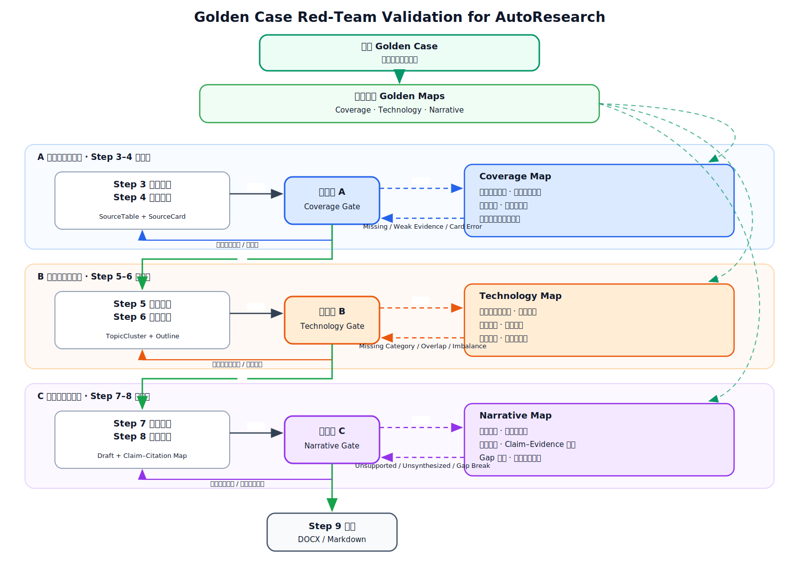

# Golden Case 红队验证基准与 AutoResearch 交互设计（V1）

## 1. 定位

《数据驱动的电力系统暂态稳定评估方法综述》作为隐藏 Golden Case，只供红队评估端读取，不直接提供给 AutoResearch 生产端。V1 的测试目标不是复写论文，而是判断 AutoResearch 在相同主题下能否独立重建三种能力：

1. **Coverage**：建立充分且边界清楚的知识覆盖；
2. **Technology**：形成按问题功能组织、层级合理的技术分类；
3. **Narrative**：完成从研究背景、分类比较和共同局限到 Research Gap 与展望的论证。

这篇论文是 AutoResearch 的固定“标准考场”。同领域回放时，红队使用论文特定的 C1–C6、T1–T6、N1–N6 做隐藏对齐；跨领域运行时只迁移 Map 的结构、判定逻辑和交互协议，不把暂态稳定领域的具体内容当成其他领域的标准答案。

> 论文没有直接使用 Coverage Map、Technology Map 和 Narrative Map 这三个名称。以下 Map 是依据论文引言、第 1–4 节、图 1–8 和 108 篇参考文献反向重建并冻结的 Golden Benchmark。

## 2. 总体交互图



[打开可编辑的 Draw.io 源文件](assets/golden-case-red-team-architecture.drawio)

图中的比对是**阶段完成后的事件触发式检查**，不是在 Agent 生成过程中逐 token 干预。生产端只接收问题类型、位置、原因、负责步骤和修复目标，不接收 Golden Case 原文、具体标准章节或缺失方法名称。

## 3. 论文特定的三张 Golden Map

### 3.1 Gold Coverage Map：Step 4 主导

Coverage Map 判断 AutoResearch 是否重建了论文所覆盖的完整知识空间。Step 3 决定进入系统的文献集合，Step 4 将文献转化为可供下游归类和写作的 SourceCard；因此检查点 A 在 Step 4 后触发，并由 Step 4 主导。

| ID | Golden Case 展示的覆盖内容 | Checkpoint A 判断重点 | 主要修复步骤 |
|---|---|---|---|
| C1 研究问题与范围边界 | 比较时域仿真、直接法和数据驱动法，将正文范围收束到数据驱动在线暂态稳定评估 | 是否说明研究对象、传统方法局限和数据驱动方法的适用边界 | Step 3 / Step 4 |
| C2 全生命周期 | 样本生成、数据预处理、模型设计、模型训练、在线预测、置信度判断、人工校核和反馈更新 | 文献集合是否覆盖离线训练、在线应用和反馈更新，而非只覆盖模型训练 | Step 3 |
| C3 数据侧 | 数据缺失、样本不平衡、输入特征选择、特征提取和异构特征融合 | 是否覆盖数据质量、样本构建与特征处理问题 | Step 3 / Step 4 |
| C4 模型侧 | 传统机器学习与深度学习，包括 DT、ANN、SVM、CNN、LSTM、SAE、DBN、Transformer、GNN 等 | 是否覆盖主要模型路线、适用场景和典型优缺点 | Step 3 / Step 4 |
| C5 学习与适应机制 | 集成学习、迁移学习、主动学习，分别处理模型组合、场景迁移和高价值样本选择 | 是否覆盖模型适应、迁移与更新机制 | Step 3 / Step 4 |
| C6 应用条件与评价边界 | 噪声、拓扑变化、运行方式变化、新能源场景，以及准确性、泛化性、鲁棒性、成本、实时性、可解释性和可信度 | 是否不仅介绍方法，还记录其验证场景、关键结论和适用边界 | Step 4 |

Checkpoint A 不以论文数量作为主要标准，而判断 SourceTable 与 SourceCard 是否共同形成 C1–C6 的知识覆盖。文献或主题缺失回 Step 3；来源已经存在但卡片理解错误回 Step 4。

### 3.2 Gold Technology Map：Step 5 主导

Technology Map 判断 AutoResearch 是否像 Golden Case 一样，按照技术在完整系统中解决的问题位置组织方法，而不是把算法名称平铺成列表。Step 5 建立 TopicCluster，Step 6 将其落实为章节层级，因此检查点 B 在 Step 6 后触发，由 Step 5 主导。

| ID | Golden Case 展示的技术结构 | Checkpoint B 判断重点 | 主要修复步骤 |
|---|---|---|---|
| T1 功能流程主轴 | 离线训练 → 在线应用 → 反馈更新，形成“数据—模型—数据”闭环 | 大纲是否具有贯穿各技术分支的系统主轴 | Step 5 / Step 6 |
| T2 三大技术支柱 | 数据增强、机器学习算法、模型学习机制 | 是否恢复覆盖完整且功能不同的一级方向 | Step 5 |
| T3 数据增强分类树 | 缺失数据处理、样本平衡、特征选择；再细分统计填补、机器学习填补、采样、GAN、过滤式/包裹式/嵌入式选择等 | 子路线是否位于正确父类，类别边界是否清楚 | Step 5 |
| T4 模型算法分类树 | 传统机器学习与深度学习；深度方法再按卷积、时序、表征和图结构模型展开 | 模型族、子方法和代表技术是否形成合理层级 | Step 5 |
| T5 学习机制分类树 | 集成学习的串行/并行，迁移学习的样本/特征/模型迁移，主动学习的查询—标注—训练—更新循环 | 是否将适应与更新机制从普通模型列表中区分出来 | Step 5 |
| T6 技术关系与比较逻辑 | 算法提供基础拟合能力，数据增强帮助模型逼近性能上限，学习机制维持性能和迁移能力 | 是否说明不同分支解决什么问题，并沿准确性、泛化性、鲁棒性、成本、实时性、可解释性等维度比较 | Step 5 / Step 6 |

Checkpoint B 允许 AutoResearch 使用不同的分类名称，只要语义角色和结构关系等价。分类缺失、重叠或归属错误回 Step 5；章节层级、均衡和顺序问题回 Step 6；如果根因是没有相应文献或卡片，则由 Controller 跨级回 Step 3 或 Step 4。

### 3.3 Gold Narrative Map：Step 7 主导

Narrative Map 判断 AutoResearch 是否完成从材料组织到学术论证的转换。Step 7 构造论证，Step 8 检查引用，因此检查点 C 在 Step 8 后触发，并由 Step 7 主导。

| ID | Golden Case 展示的叙事功能 | Checkpoint C 判断重点 | 主要修复步骤 |
|---|---|---|---|
| N1 建立问题重要性 | 新能源、电力电子化和负荷随机性导致稳定边界变化，传统方法难以兼顾速度与准确性 | 开篇是否建立真实领域矛盾，而非只宣称研究热门 | Step 7 |
| N2 比较现有范式并指出综述缺口 | 已有综述关注算法与场景适配，但缺少“数据—模型—数据”闭环和实际应用流程的系统论述 | 综述自身的定位是否由已有工作不足推出 | Step 7 / Step 8 |
| N3 先建立总架构 | 在分类文献之前先建立离线训练、在线应用和反馈更新框架 | 技术分类是否由总问题框架统领 | Step 7 |
| N4 按因果链组织文献 | 数据基础 → 模型拟合 → 场景适应 | 文献是否围绕共同问题综合，而非逐篇罗列 | Step 7 |
| N5 从比较中归纳共同局限 | 数据缺失与失衡、模型黑箱与泛化不足、负迁移、主动学习不稳定和工程可信度不足 | 局限是否来自前文的系统比较 | Step 7 / Step 8 |
| N6 从局限推导研究方向 | 从数据、模型、应用三层提出统一数据平台、新模型、物理—数据融合、可解释性和人在回路等方向 | Research Gap 与展望是否能回溯到前文比较和局限 | Step 7 / Step 8 |

Golden Narrative Map 的核心顺序为：

```text
领域变化与传统方法局限
→ 已有综述缺口
→ 建立完整系统架构
→ 构建技术分类并综合文献
→ 比较优势、条件与共同局限
→ 推导 Research Gap 与未来方向
```

Checkpoint C 不比较文本相似度。缺少综合、比较或 Gap 推导回 Step 7；引用不能支持论断回 Step 8；如果叙事问题来自分类或材料缺失，Controller 跨级回 Step 5–6 或 Step 3–4。

## 4. 红队 Team

运行时采用一个 Controller 和三个相互隔离的 Judge：

| 角色 | 输入 | 职责 | 可读取的 Golden 内容 |
|---|---|---|---|
| Red-Team Controller | 各阶段冻结快照、Judge 结果和运行状态 | 触发检查、汇总判定、选择最早可修复步骤、控制通过与回流 | Map ID、路由规则；不读取论文正文 |
| Coverage Judge | Research Scope、SourceTable、SourceCard | 将候选知识覆盖与 C1–C6 做语义对齐 | 仅 Gold Coverage Map |
| Technology Judge | Validated Coverage Profile、TopicCluster、Outline | 将候选技术分类与 T1–T6 的节点和关系做概念对齐 | 仅 Gold Technology Map |
| Narrative Judge | Validated Technology Profile、Draft、引用检查结果 | 将候选论证链与 N1–N6 做功能和顺序对齐 | 仅 Gold Narrative Map |

Golden Map 在测试前离线构建、人工确认并冻结。生产端 Agent 不读取 Golden Map，三个 Judge 也不相互读取对方的 Golden 内容。

## 5. V1 交互链路

### 5.1 主流程

```text
Step 1 需求解析
  → Step 2 关键词确认
  → Step 3 文献导入
  → Step 4 文献卡片
  → A：Coverage Judge
  → Step 5 方向归类
  → Step 6 大纲确认
  → B：Technology Judge
  → Step 7 章节写作
  → Step 8 引用检查
  → C：Narrative Judge
  → Step 9 导出
```

| 检查点 | 触发时点 | 冻结快照 | 隐藏比对 | 通过后的正向产物 | 失败后的主要回流 |
|---|---|---|---|---|---|
| A Coverage | Step 4 完成后 | SourceTable + SourceCard | C1–C6 | Validated Coverage Profile，随有效 SourceCard 进入 Step 5 | 缺材料回 Step 3；卡片错误回 Step 4 |
| B Technology | Step 6 完成后 | TopicCluster + Outline | T1–T6 | Validated Technology Profile，随确认大纲进入 Step 7 | 分类回 Step 5；层级与顺序回 Step 6；材料不足跨级回 Step 3/4 |
| C Narrative | Step 8 完成后 | Draft + 引用检查结果 | N1–N6 | Final Narrative Decision，决定是否开放 Step 9 | 论证回 Step 7；引用回 Step 8；分类或材料根因跨级回更早步骤 |

### 5.2 正向信息流

A 通过后形成 **Validated Coverage Profile**，只描述候选结果已经覆盖的研究问题、主题、有效 SourceCard 和仍需注意的薄弱方向，不暴露 Golden Case 的缺失答案。

B 通过后形成 **Validated Technology Profile**，包含已经确认的方法族、层级关系、章节任务、横向比较维度和章节对应的 SourceCard，使 Step 7 在稳定结构上写作。

C 通过后形成 **Final Narrative Decision**，说明叙事功能、Gap 推导和引用检查是否达到导出条件。

### 5.3 反向诊断流

Judge 返回统一诊断，不直接替生产端补写内容：

```text
checkpoint
map_element_id
status: Pass | Partial | Fail
candidate_location
problem_type
reason
root_step
repair_goal
```

允许返回“学习适应机制没有形成独立技术分支，应回 Step 5 重新检查分类”，但不能直接给出“增加迁移学习和主动学习两个章节”等 Golden 标准答案。

### 5.4 最早根因回流

Controller 不机械地只退回上一步，而是把问题路由到最早能够实际修复它的步骤：

| 根因 | 回流步骤 |
|---|---|
| 缺少必要文献或研究主题 | Step 3 |
| 文献存在但卡片理解错误 | Step 4 |
| 方法族、子路线或归属错误 | Step 5 |
| 章节层级、篇幅或顺序错误 | Step 6 |
| 缺少综合比较或 Gap 推导断裂 | Step 7 |
| 引用无法支持论断 | Step 8 |

例如，Narrative Judge 发现某个 Gap 没有前文基础时，先判断是 Step 7 没有完成综合，还是 Step 5 根本没有形成对应技术类别，抑或 Step 3 没有检索到相关材料，再由 Controller 路由到真正根因。

## 6. 检查协议与判定

每个检查点执行同一协议：

1. **冻结首次产物**：保存 A0、B0 或 C0，不允许修复覆盖首次结果；
2. **逐元素判定**：对应 Map 的六个元素分别标记为 Pass、Partial 或 Fail；
3. **生成诊断**：只返回问题、位置、根因步骤和修复目标；
4. **执行路由**：核心元素 Fail 必须回流；非核心 Partial 可携带风险进入下一阶段；
5. **重新评估**：修复版本再次进入同一检查点；
6. **保留记录**：记录 First-pass、Repaired、Repair Gain 和 Iteration Count。

V1 暂不依赖复杂百分制，优先保证诊断可解释和回流可执行。后续如需数值化，可在六个元素稳定后再设置元素权重与通过阈值。

## 7. 使用边界

| 场景 | Golden Case 的作用 | 不应进行的比较 |
|---|---|---|
| 同主题隐藏回放 | 具体比较 C1–C6、T1–T6、N1–N6 的内容、关系和论证顺序 | 不要求章节标题、分类名称和文字表达完全一致 |
| 跨领域 AutoResearch | 迁移三张 Map 的节点类型、关系语法、检查点和回流机制 | 不拿暂态稳定方法、具体文献和领域结论作为其他领域答案 |

这篇论文提供的是一套可验证的标准案例：**先建立系统架构，再形成技术分类，最后从分类比较中推导 Research Gap。** Golden Case 用于验证 AutoResearch 是否具备重建这套能力，而不是证明所有新领域都不存在遗漏。
