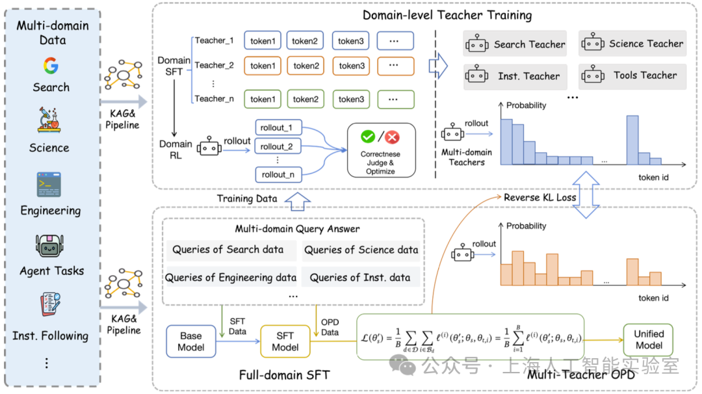

# Agents-A1 备用参考资料

本目录保存上海人工智能实验室 Agents-A1 项目的备用参考资料，用于 AutoResearch Agent 的架构、训练轨迹和评测设计讨论。

## 官方来源

- 技术报告：[Scaling the Horizon, Not the Parameters: Reaching Trillion-Parameter Performance with a 35B Agent](https://arxiv.org/abs/2606.30616)
- 评测仓库：[InternScience/Agents-A1](https://github.com/InternScience/Agents-A1)
- 模型权重：[InternScience/Agents-A1](https://huggingface.co/InternScience/Agents-A1)

## 训练框架图

该图片作为备用架构参考，对应论文中的三阶段训练思路：全域 SFT、领域级教师训练，以及多教师域路由在策略蒸馏。图片仅用于研究设计讨论，不属于本仓库的 Golden Case 标准答案。
